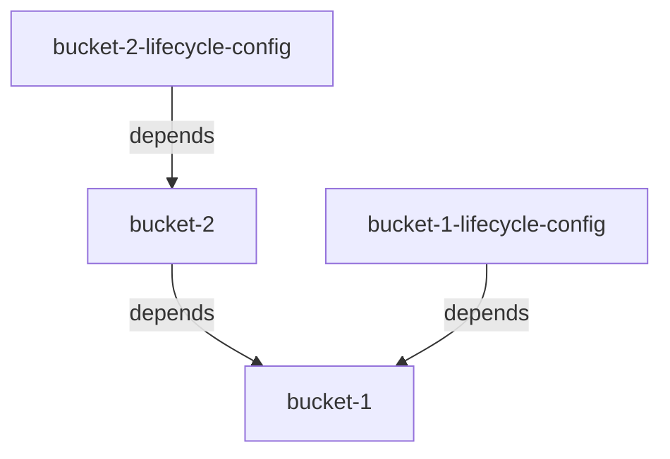

# terragrunt quickie


```mermaid
flowchart TD
  bucket-2 -- depends --> bucket-1
  bucket-1-lifecycle-config -- depends --> bucket-1
  bucket-2-lifecycle-config -- depends --> bucket-2
```

## usage

```sh
aws-vault exec <xxxxxxx> -- terragrunt run-all plan
````

```sh
aws-vault exec <xxxxxxx> -- terragrunt run-all apply
````
